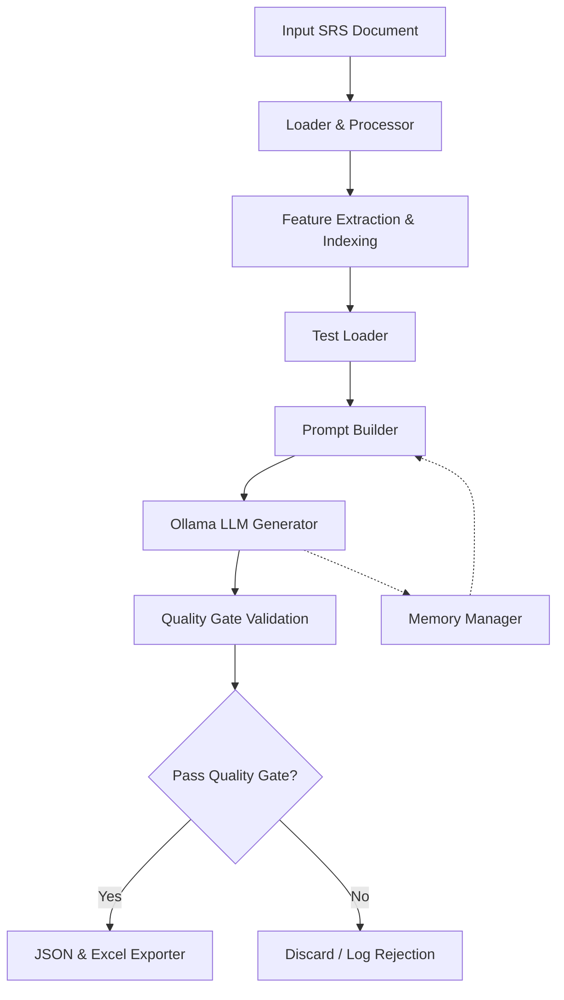

# Requirement Intelligence Test Case Generator

An advanced, AI-assisted QA automation platform that transforms raw Software Requirement Specifications (SRS) into structured, deduplicated, and evidence-backed test cases using a local Large Language Model (LLM).

## Features

- **Document Ingestion:** Parses raw requirement documents (DOCX, PDF, TXT).
- **Intelligent Prompting:** Instructs the LLM to comprehensively extract all valid scenarios without hallucinating boundary conditions.
- **Iterative Generation:** Remembers past generations to incrementally build comprehensive test suites over multiple runs without overwriting past work.
- **Strict Quality Gates:** Programmatically rejects invalid test cases, ensures mandatory fields, and verifies that the LLM's cited `evidence_quote` genuinely exists in the original SRS text.
- **Semantic Deduplication:** Uses token-based signature matching (ignoring boilerplate UI steps) to reject conceptual duplicates.

---

## Architecture & Workflow

The system is designed as a multi-stage pipeline ensuring high-quality, strictly grounded outputs.



### The Generation Lifecycle
1. **Context Assembly & Iterative Loading:** The system finds the target feature text in the SRS. It checks for the latest versioned JSON output to load past test cases, preventing the LLM from duplicating previous work.
2. **Prompt Construction:** The `PromptBuilder` constructs a highly restrictive prompt (e.g., Extract EVERY possible valid testcase, provide an exact short evidence quote, return strict JSON).
3. **LLM Inference:** The prompt is sent to a local Ollama instance (e.g., `qwen2.5-coder:7b`). It automatically handles continuation prompts if the context window truncates the JSON.
4. **Quality Gate:** The `QualityGate` validates the structure and performs a strict line-by-line similarity check (>80%) to ensure the `evidence_quote` genuinely exists in the SRS. It also generates a unique signature for the scenario to filter out semantic duplicates.
5. **Finalization & Export:** Valid test cases are assigned IDs (e.g., TC-001) and exported incrementally to JSON and Excel formats.

---

## Quick Start

### 1. Install Ollama & Pull the Model
Install Ollama on your system, then pull and run the target model:
```bash
ollama pull qwen2.5-coder:7b or gemma3:4b
ollama run qwen2.5-coder:7b or gemma3:4b
```

### 2. Setup Python Environment
Create a virtual environment and install the dependencies:
```bash
python -m venv .venv
# On Windows:
.venv\Scripts\activate
# On macOS/Linux:
source .venv/bin/activate

pip install -e .
cp .env.example .env
```

### 3. Generate Test Cases
Place your target SRS document in the `reqs/` folder, then run the test loader script:
```bash
python test_loader.py
```
Check the terminal for real-time Quality Gate rejections and validations. Final outputs will be saved in `runtime_data/generated/`.

---

## Environment Configuration

The pipeline's behavior is heavily influenced by the `.env` configuration passed to the LLM. 

- **`PPAI_LLM_NUM_CTX=6554`**: The context window limit. Lowering this from 8192 to 6554 reduces memory usage by ~20%, significantly speeding up generation times without risking truncation for standard-sized SRS documents.
- **`PPAI_LLM_SEED=42`**: Ensures deterministic outputs for debugging.
- **`PPAI_LLM_TEMPERATURE=0.2`**: Controls the "creativity" of the LLM. 
  - `0.0`: Rigid and analytical, but tends to stop early (2-5 test cases).
  - `0.2`: The sweet spot. Encourages the model to push past its natural stopping point and generate a more comprehensive list (10+ test cases) without hallucinating fake features.

---

## Expected JSON Output Example

```json
{
  "feature_id": "1",
  "feature_name": "Create Daily Time Log Entry",
  "test_cases": [
    {
      "test_case_id": "TC-001",
      "title": "Verify that a user can successfully log time with valid inputs",
      "type": "positive",
      "source_requirement_ids": [
        "F1_C003"
      ],
      "evidence_quote": "User can successfully log time with valid inputs",
      "assumption_flag": false,
      "preconditions": [
        "User must be authenticated",
        "Project must be active"
      ],
      "steps": [
        "1. Log into the Calculus application",
        "2. Click 'Add work Log' button from the landing page",
        "3. Select a valid date, work log category, project, hours greater than zero, and enter a work description of at least 10 characters"
      ],
      "expected_result": [
        "The system should save the entry as Draft or submit it successfully"
      ]
    }
  ],
  "generated_test_case_count": 1,
  "new_test_case_count": 1,
  "no_new_test_cases": false
}
```
*(Note: Any missing details requiring assumptions are printed directly to the terminal rather than saved in the JSON).*
