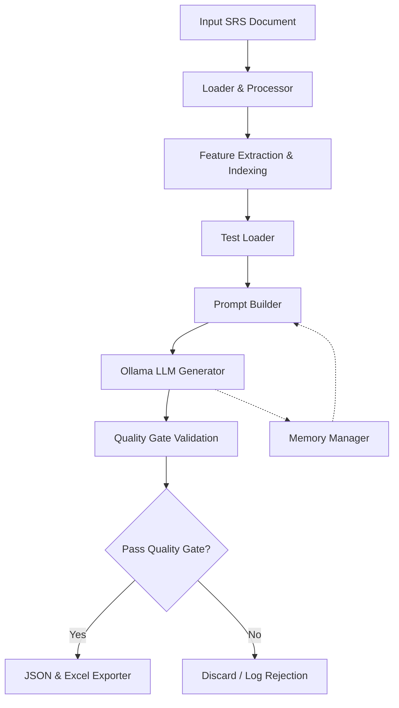

# Requirement Intelligence Test Case Generator
## System Architecture & Workflow Document

This document provides a comprehensive overview of the automated test case generation pipeline, detailing how raw Software Requirement Specifications (SRS) are transformed into structured, evidence-backed test cases using a local Large Language Model (LLM).

---

## 1. Architecture Workflow

The system is designed as a multi-stage pipeline that ensures generated test cases are strictly grounded in the provided requirements, structurally sound, and deduplicated.



### High-Level Stages:
1. **Ingestion:** The raw SRS document (e.g., DOCX) is loaded and parsed into raw text.
2. **Processing:** The text is chunked and analyzed to identify distinct "Features" (e.g., "Create Daily Time Log Entry").
3. **Coordination:** The user selects a scope (a specific feature or all features). The main controller handles the execution loop.
4. **Iterative Generation:** If this is the first time running a feature, the system starts fresh. However, if previous JSON output exists, the system automatically loads the latest version. It sends these existing test cases to the LLM so it knows what has already been covered, and the Quality Gate uses them to block any newly hallucinated duplicates. This allows the system to incrementally build out comprehensive test suites over multiple runs without overwriting past work.
5. **Quality Assurance:** Every generated test case must pass a rigid programmatic quality gate that verifies formatting, mandatory fields, evidence existence, and semantic uniqueness.
6. **Export:** Validated test cases are saved incrementally to JSON and Excel formats.

---

## 2. Step-by-Step Model's Road to Generate Test Cases

This is the exact lifecycle of a single feature being processed by the LLM:

**Step 1: Context Assembly & Iterative Loading**
The system identifies the target feature text. It looks for the latest versioned JSON file for this feature in the `runtime_data/generated` directory. If it finds one, it loads it into memory. If not, it starts completely fresh. It also checks the `MemoryManager` for any past test cases to prevent the LLM from repeating itself, and pulls a summary of other features in the SRS (for cross-feature context).

**Step 2: Prompt Construction**
The `PromptBuilder` constructs a highly restrictive prompt. It instructs the LLM to:
- Act as a senior SQA engineer.
- Extract EVERY possible valid test case in a single run.
- Provide an exact short evidence quote from the SRS for every test case.
- Avoid inventing UI constraints, rules, or boundaries not explicitly in the text.
- Return ONLY a strict JSON format.

**Step 3: LLM Inference**
The `OllamaScenarioGenerator` sends the prompt to the local Ollama instance (configured with low temperature for deterministic, analytical outputs). If the model's response is cut off due to context limits, the system detects the broken JSON and automatically sends a continuation prompt to stitch the response back together.

**Step 4: Quality Gate - Structural & Logic Check**
The raw JSON is parsed. The `QualityGate` checks:
- Does the title start with allowed prefixes (e.g., "Verify that...")?
- Are steps and expected results present?
- If it's a boundary test, does it actually test a numeric/date limit?
- Is the assumption flag false?

**Step 5: Quality Gate - Evidence Verification**
The system extracts the `evidence_quote` from the generated test case and searches for it in the original SRS text. 
- It first looks for an exact substring match.
- If it fails, it checks similarity **line-by-line** against the SRS text. The quote must be >80% similar to an actual line in the SRS to pass, preventing the model from hallucinating requirements.

**Step 6: Quality Gate - Deduplication**
A unique `testcase_signature` is generated for the test case (comprising the `title`, `evidence_quote`, `type`, and `source_requirement_ids`). This signature is compared against all previously accepted test cases. If it has a >= 75% lexical similarity to an existing signature, it is rejected as a conceptual duplicate.

**Step 7: Finalization**
Test cases that survive the Quality Gate are assigned sequential IDs (e.g., TC-001) and added to the cumulative pool, which is then written to disk.

---

## 3. Core Functions & File Locations

Below is a map of the core logic, organized by the file where it resides.

### `test_loader.py` (The Main Controller)
- **`_select_features_for_request()`**: Determines whether to process a single feature or the entire document based on user input.
- **`_find_latest_version()` / `_load_existing_test_cases()`**: Identifies and loads the most recent JSON output for a feature to enable iterative, cumulative generation without overwriting past work.
- **Main Execution Loop**: Drives the end-to-end process, invoking the processor, generator, and exporters.

### `ppai_test_umbrella/modules/requirement_intelligence/loader.py`
- **`load_requirement_text()`**: Reads the target document (DOCX/TXT/PDF) and extracts the raw string content.

### `ppai_test_umbrella/modules/requirement_intelligence/requirement_processor.py`
- **`RequirementKnowledgeProcessor.build_index()`**: Analyzes the raw text, divides it into logical chunks, and identifies top-level features for testing.
- **`build_test_case_generation_prompt()`**: Assembles the initial feature text and context for the LLM.

### `ppai_test_umbrella/modules/requirement_intelligence/prompt_builder.py`
- **`build_generation_rules()`**: Defines the "HARD RULES" the LLM must follow (e.g., exhaustive extraction, evidence mapping, strict JSON formatting).
- **`build_iterative_instruction()`**: Provides the LLM with a list of already-generated test cases and explicitly instructs it to only find new, distinct functional scenarios.
- **`build_continuation_instruction()`**: Handles the logic for prompting the model to resume a truncated JSON response.

### `ppai_test_umbrella/modules/requirement_intelligence/scenario_generator.py`
- **`OllamaScenarioGenerator.generate_from_prompt()`**: The main wrapper that orchestrates the LLM call, parsing, and quality gate filtering.
- **`_call_ollama()`**: Handles the HTTP request to the local Ollama API, managing parameters like temperature, timeout, and context window size.
- **`_parse_json_response()` / `_attempt_continuation()`**: Robustly extracts JSON from the LLM's text output, using regex fallbacks and continuation loops if the output is malformed or cut off.

### `ppai_test_umbrella/modules/requirement_intelligence/quality_gate.py`
- **`evidence_is_present()`**: Verifies that the LLM's `evidence_quote` genuinely exists in the SRS text, using exact matching or a line-by-line >80% similarity fallback.
- **`validate_testcase()`**: Ensures the structural integrity of the test case (title prefixes, mandatory fields, boundary logic validation).
- **`testcase_signature()`**: Creates a normalized token string (ignoring boilerplate steps/expected results) used for identifying unique scenarios.
- **`similarity()`**: Computes a mathematical overlap score (Jaccard + SequenceMatcher) between two text strings.
- **`filter_and_deduplicate()`**: Runs the validation and signature similarity checks (>= 75% threshold) to separate valid new test cases from rejected/duplicate ones.

### `ppai_test_umbrella/modules/requirement_intelligence/exporter.py`
- **`export_test_cases_json()` / `export_test_cases_excel()`**: Formats the final accepted dictionaries into structured output files.

---

## 4. Environment Configuration

The pipeline's behavior is heavily influenced by the `.env` configuration passed to the LLM. 

### Key Variables:
- **`PPAI_LLM_NUM_CTX=6554`**: The context window limit (how many tokens the model can "see" at once, including the prompt, the SRS, and its own output). Lowering this from 8192 to 6554 reduces memory usage by ~20%, significantly speeding up generation times without risking truncation for standard-sized SRS documents.
- **`PPAI_LLM_SEED=42`**: Ensures that if you run the exact same prompt with the exact same temperature twice, the model will output the exact same test cases. This makes debugging and iterative improvements predictable.
- **`PPAI_LLM_TEMPERATURE=0.2`**: Controls the "creativity" or randomness of the LLM.

### Impact of Temperature Settings:
- **`Temperature = 0.0`**: The model is completely analytical and rigid. It will only generate the test cases it is 100% certain about based strictly on the text, but it tends to stop early (generating only 2-5 test cases).
- **`Temperature = 0.1`**: Adds a tiny bit of flexibility. The model might combine slightly different requirements or attempt to cover one or two extra obvious boundary cases, but remains very conservative.
- **`Temperature = 0.2`**: The sweet spot for generating longer lists. The model becomes slightly more "creative" in how it interprets testable behavior, encouraging it to push past its natural stopping point and generate a more comprehensive list (e.g., 10+ test cases) without hallucinating fake features.

---

## 5. JSON Output Format

When the pipeline completes successfully, it produces a JSON file following this exact schema. 

```json
{
  "feature_id": "1",
  "feature_name": "Create Daily Time Log Entry",
  "test_cases": [
    {
      "test_case_id": "TC-001",
      "title": "Verify that a user can successfully log time with valid inputs",
      "type": "positive",
      "source_requirement_ids": [
        "F1_C003"
      ],
      "evidence_quote": "User can successfully log time with valid inputs",
      "assumption_flag": false,
      "preconditions": [
        "User must be authenticated",
        "Project must be active"
      ],
      "steps": [
        "1. Log into the Calculus application",
        "2. Click 'Add work Log' button from the landing page",
        "3. Select a valid date, work log category, project, hours greater than zero, and enter a work description of at least 10 characters"
      ],
      "expected_result": [
        "The system should save the entry as Draft or submit it successfully"
      ]
    }
  ],
  "generated_test_case_count": 1,
  "new_test_case_count": 1,
  "no_new_test_cases": false
}
```

### Key Output Fields:
- **`test_cases`**: The array of fully validated, deduplicated scenarios.
- **`evidence_quote`**: The exact string extracted from the SRS proving the test case is valid.
- **`assumption_flag`**: Always enforced to `false` (assumptions are moved to terminal output).
- **`generated_test_case_count` / `new_test_case_count`**: Used to track convergence across iterative runs.
- **`no_new_test_cases`**: A boolean flag the LLM sets to `true` when it determines the SRS is 100% covered.
